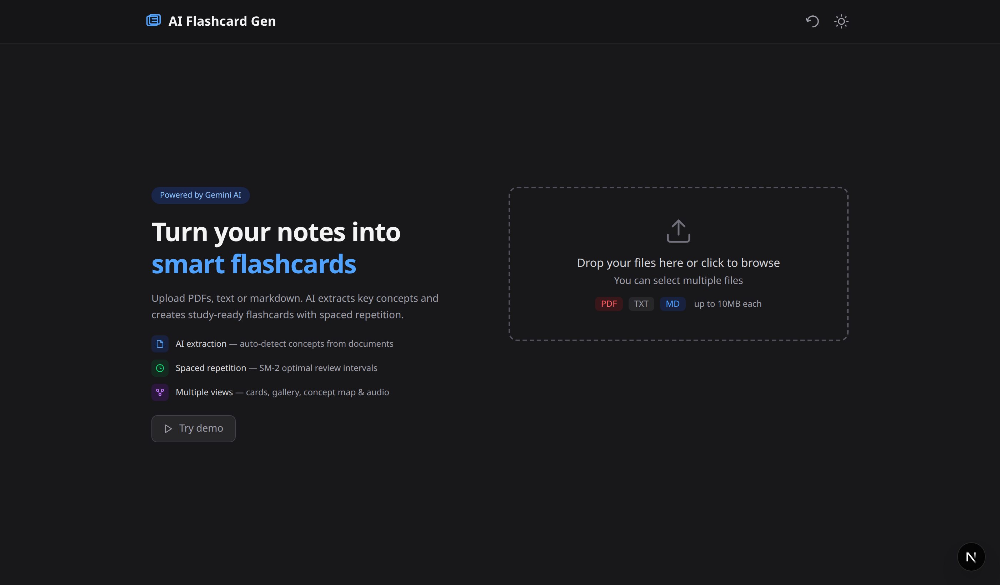
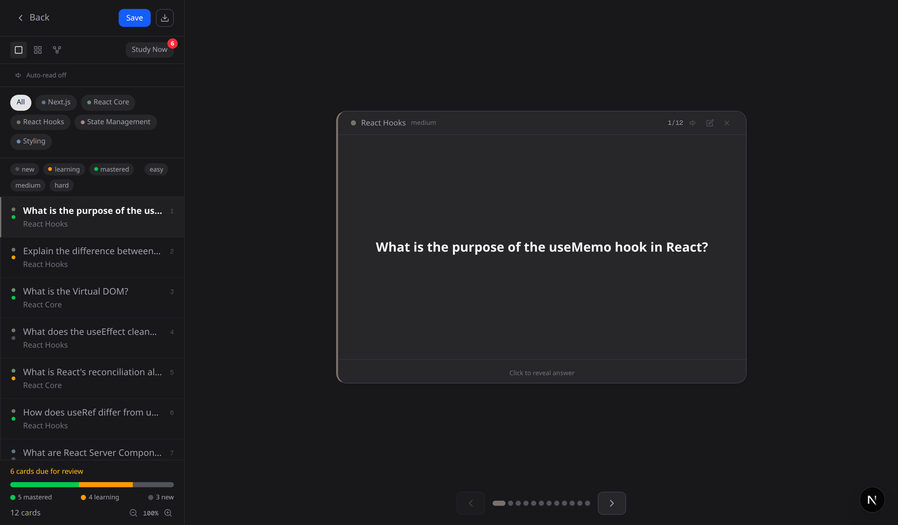
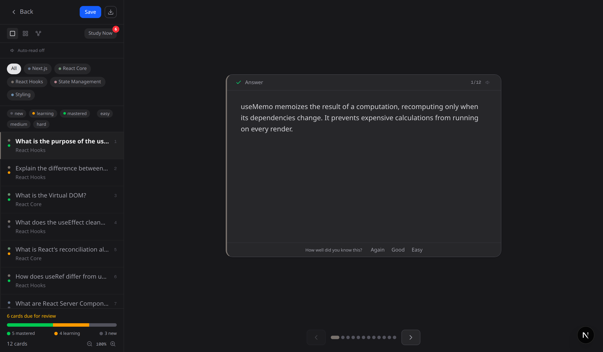
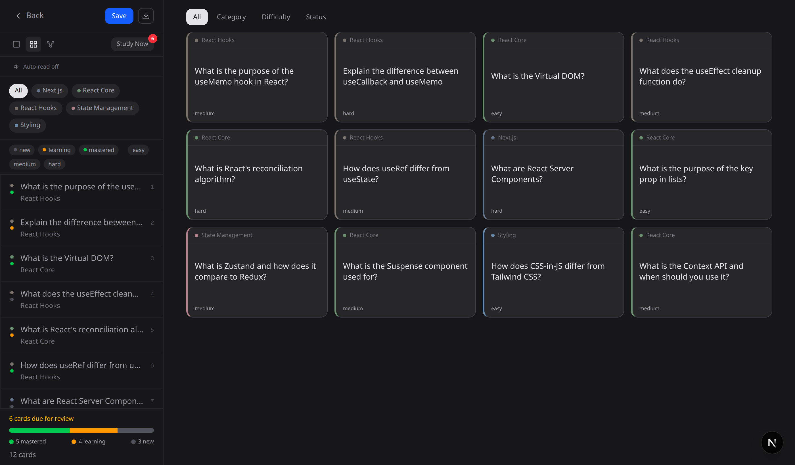
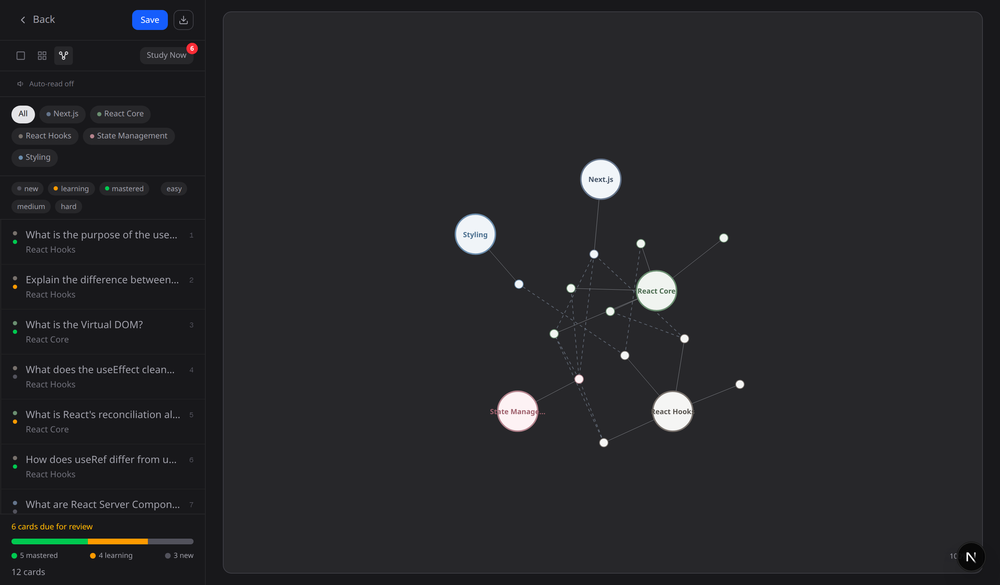

<p align="center">
  
</p>

<h1 align="center">AI Flashcard Gen</h1>

<p align="center">
  <strong>Turn any document into smart flashcards with AI-powered extraction and spaced repetition.</strong>
</p>

<p align="center">
  
  
  
  
  
</p>

---

## About

AI Flashcard Gen is a study tool that extracts key concepts from your documents and generates ready-to-study flashcards. Upload PDFs, text or markdown files — the AI handles the rest.

Built for students, professionals and anyone who learns. Drop your material, get flashcards, study with spaced repetition.

### Study View — Single Card

<p align="center">
  
</p>

### Answer Side — Mastery Tracking

<p align="center">
  
</p>

### Gallery View

<p align="center">
  
</p>

### Concept Map

<p align="center">
  
</p>

---

## Features

| | Feature | Description |
|---|---|---|
| :brain: | **AI Extraction** | Gemini 2.0 Flash analyzes your documents and generates question/answer pairs automatically |
| :repeat: | **Spaced Repetition** | SM-2 algorithm schedules optimal review intervals — study what you need, when you need it |
| :card_index: | **Single Card View** | Navigate flashcards one at a time with flip animations, mastery tracking and keyboard shortcuts |
| :framed_picture: | **Gallery View** | Grid layout to browse all cards at a glance, with inline flip and sorting by category, difficulty or status |
| :globe_with_meridians: | **Concept Map** | Interactive force-directed graph showing relationships between concepts and categories |
| :speaker: | **Text-to-Speech** | Listen to questions and answers with auto language detection (English/Spanish) |
| :file_folder: | **Multi-file Upload** | Drag & drop multiple files at once — PDF, TXT and Markdown supported |
| :bar_chart: | **Study Stats** | Track your progress with mastery counts, due cards and review streaks |
| :first_quarter_moon: | **Dark Mode** | Full light/dark theme support |
| :floppy_disk: | **Local Storage** | Your flashcards persist in the browser — no account needed |
| :shield: | **Smart Fallback** | If AI generation fails, a heuristic parser extracts cards from text structure |

---

## Tech Stack

| Layer | Technology |
|---|---|
| Framework | Next.js 16 with Turbopack |
| Frontend | React 19, Tailwind CSS 4 |
| State | Zustand 5 |
| AI | Google Gemini 2.0 Flash (`@google/genai`) |
| PDF | pdf-parse with raw bytes fallback |
| Audio | Web Speech API (native, zero dependencies) |
| Language | TypeScript 5 |

---

## Getting Started

### Prerequisites

- **Node.js** 18+ installed ([download](https://nodejs.org/))
- **Google Gemini API key** — free at [Google AI Studio](https://aistudio.google.com/apikey)

### 1. Clone the repository

```bash
git clone https://github.com/uxdreaming/AI-Flashcard-Gen.git
cd AI-Flashcard-Gen
```

### 2. Install dependencies

```bash
npm install
```

### 3. Configure environment

```bash
cp .env.example .env.local
```

Open `.env.local` and add your Gemini API key:

```env
GEMINI_API_KEY=your_api_key_here
```

### 4. Run the development server

```bash
npm run dev
```

### 5. Open in browser

Navigate to **[http://localhost:3000](http://localhost:3000)** and start uploading your study material.

---

## Supported Formats

| Format | Extension | Details |
|---|---|---|
| :page_facing_up: PDF | `.pdf` | Text extraction with raw bytes fallback for complex files |
| :memo: Plain text | `.txt` | Direct text processing |
| :bookmark_tabs: Markdown | `.md` | Supports headers, lists, tables and structured content |

**Max file size:** 10 MB per file. Multiple files can be uploaded at once.

---

## How It Works

```
Document Upload  →  Text Extraction  →  AI Analysis  →  Flashcard Generation
     .pdf              pdf-parse           Gemini 2.0        Q&A pairs with
     .txt              raw fallback        Flash              categories &
     .md                                                      difficulty
```

1. **Upload** — Drag & drop or browse for files (PDF, TXT, MD)
2. **Configure** — Choose difficulty level (Basic / Intermediate / Advanced) and card count (5-30)
3. **Generate** — AI extracts key concepts and creates flashcards
4. **Study** — Review cards in single view, gallery or concept map with spaced repetition
5. **Listen** — Use text-to-speech to hear questions and answers
6. **Track** — Monitor mastery progress with "Study Now" for due reviews

---

## Read Mode: Bilingual Text-to-Speech

One of the most technically interesting features is **Read Mode** — a text-to-speech system that automatically detects whether a flashcard is in English or Spanish and reads it aloud in the correct language.

### The Problem

The Web Speech API requires you to specify a language code (`en-US`, `es-ES`) before speaking. If you set the wrong language, the speech engine mispronounces everything — an English voice reading Spanish sounds broken, and vice versa. Since flashcards can contain content in either language (or mixed), the system needs to figure out the language on its own, per card, in real time.

### How Language Detection Works

Instead of using an external library or API call, the solution uses a **regex-based heuristic** that checks for Spanish-specific patterns:

```typescript
const spanishPattern = /[áéíóúñ¿¡]|(\b(el|la|los|las|de|del|en|es|un|una|que|por|con|para|como|más|pero|este|esta)\b)/i;
```

This catches two signals:
- **Diacritical characters** — `á`, `é`, `í`, `ó`, `ú`, `ñ`, `¿`, `¡` are strong indicators of Spanish text
- **High-frequency words** — Articles (`el`, `la`, `los`, `las`), prepositions (`de`, `en`, `por`, `con`, `para`) and common words (`que`, `más`, `pero`) that appear in virtually any Spanish sentence

If either pattern matches, the card is treated as Spanish (`es-ES`). Otherwise it defaults to English (`en-US`). This zero-dependency approach runs instantly and handles the vast majority of real-world study content correctly.

### Voice Selection

After detecting the language, the system queries the browser's available voices and picks one that matches:

```typescript
const voices = window.speechSynthesis.getVoices();
const matchingVoice = voices.find((v) => v.lang.startsWith(lang));
```

This is important because different browsers and operating systems ship different voice sets. On Chrome, Google's voices are available. On macOS, Apple's system voices are used. The code gracefully falls back to the default voice if no match is found.

### Auto-Read Mode

Beyond manual playback (clicking the speaker icon), there's an **Auto-Read** toggle in the sidebar that automatically reads each question aloud as you navigate between cards. This creates a hands-free study experience — useful for auditory learners or when reviewing cards away from the screen.

The auto-read triggers on card index changes but only in single-card view:

```typescript
useEffect(() => {
  if (autoRead && activeCards[currentIndex] && viewMode === "single") {
    speak(activeCards[currentIndex].question);
  }
}, [currentIndex, autoRead, viewMode]);
```

### Integration Points

The audio system is structured as a custom React hook (`useAudio`) that exposes a clean API:

| Export | Purpose |
|---|---|
| `speak(text)` | Detect language, select voice, and read text aloud |
| `stop()` | Cancel any active speech |
| `speaking` | Boolean state for UI feedback (icon highlighting) |
| `autoRead` | Whether auto-read mode is enabled |
| `toggleAutoRead()` | Toggle auto-read on/off |

This hook is consumed by `FlashcardList` (auto-read logic) and passed down to `FlashcardItem` (manual playback buttons on both the question and answer sides of each card).

### What Made This Challenging

- **No external dependencies** — The entire feature runs on the native Web Speech API, which means zero bundle size impact but also dealing with browser inconsistencies in voice availability and timing
- **Per-card language switching** — Each card can be a different language, so detection happens at speak time, not once globally
- **Speech lifecycle management** — Canceling previous speech before starting new speech, cleaning up on unmount, and syncing the `speaking` state across components required careful ref and effect management
- **Cross-browser voice availability** — `getVoices()` returns an empty array on first call in some browsers (it loads asynchronously), which the code handles by falling back gracefully

---

## Project Structure

```
AI-Flashcard-Gen/
├── src/
│   ├── app/
│   │   ├── api/generate/     # API route for flashcard generation
│   │   ├── layout.tsx        # Root layout with Geist fonts
│   │   ├── page.tsx          # Landing page & study mode entry
│   │   └── globals.css       # Global styles & animations
│   ├── components/
│   │   ├── FlashcardItem.tsx  # Single card with flip animation
│   │   ├── FlashcardList.tsx  # Main study interface & sidebar
│   │   ├── GalleryView.tsx    # Grid view with mini-cards
│   │   ├── ConceptMap.tsx     # Force-directed concept graph
│   │   ├── FileUpload.tsx     # Drag & drop upload zone
│   │   ├── LoadingIndicator.tsx
│   │   ├── StudyStats.tsx     # Progress statistics
│   │   └── ThemeToggle.tsx    # Dark/light mode switch
│   ├── hooks/
│   │   └── useAudio.ts       # Text-to-speech hook
│   ├── lib/
│   │   ├── gemini.ts          # Gemini AI integration
│   │   ├── extractText.ts     # PDF & text extraction
│   │   ├── parseFlashcards.ts # Heuristic fallback parser
│   │   ├── spacedRepetition.ts # SM-2 algorithm
│   │   ├── categoryColors.ts  # Muted color palette
│   │   └── exportCards.ts     # CSV/JSON export
│   ├── store/
│   │   └── useFlashcardStore.ts # Zustand state management
│   └── types/
│       └── flashcard.ts       # TypeScript interfaces
├── docs/                      # Screenshots & assets
├── .env.example               # Environment template
└── package.json
```

---

## Scripts

| Command | Description |
|---|---|
| `npm run dev` | Start development server with Turbopack |
| `npm run build` | Production build |
| `npm run start` | Start production server |
| `npm run lint` | Run ESLint |

---

## Completed Features

| | Feature |
|---|---|
| :white_check_mark: | Text extraction from PDF with raw bytes fallback |
| :white_check_mark: | AI flashcard generation with Gemini 2.0 Flash |
| :white_check_mark: | Support for PDF, TXT and Markdown files |
| :white_check_mark: | Drag & drop multi-file upload with validation |
| :white_check_mark: | Difficulty selector (Basic / Intermediate / Advanced) |
| :white_check_mark: | Flashcard count selector (5, 10, 15, 20, 30) |
| :white_check_mark: | Single card view with 3D flip animation |
| :white_check_mark: | Gallery view with mini-card grid and inline flip |
| :white_check_mark: | Interactive concept map with force-directed graph |
| :white_check_mark: | Text-to-speech with auto language detection |
| :white_check_mark: | SM-2 spaced repetition algorithm |
| :white_check_mark: | "Study Now" mode filtering due cards |
| :white_check_mark: | Mastery tracking (Again / Good / Easy) |
| :white_check_mark: | Category, status and difficulty filters |
| :white_check_mark: | CSV and JSON export |
| :white_check_mark: | Dark mode with system detection |
| :white_check_mark: | Local storage persistence |
| :white_check_mark: | Heuristic fallback parser when AI is unavailable |
| :white_check_mark: | Rate limiting on API endpoint |
| :white_check_mark: | Keyboard navigation between cards |
| :white_check_mark: | Responsive design (mobile + desktop) |
| :white_check_mark: | Clean visual design with muted color palette |

---

## License

MIT

---

<p align="center">
  <sub>Built with :blue_heart: by <a href="https://github.com/uxdreaming">uxdreaming</a></sub>
</p>
